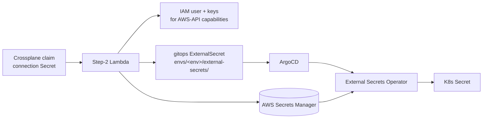

# External Secrets bootstrap

The app-facing secret-delivery layer for the Makeway platform. Credentials
Crossplane writes into each Claim's connection Secret are mirrored into AWS
Secrets Manager by the Step-2 worker, which also commits an
`ExternalSecret` per capability into the env overlay
(`argocd/apps/<app>/envs/<env>/external-secrets/`). External Secrets Operator
(ESO) materializes the matching `K8s Secret` into the app namespace, and the
Deployment references it via `envFrom` / `valueFrom`.



## Cluster-side setup (once)

1. **Install ESO** (ArgoCD-managed Helm chart — same pattern Crossplane uses):

   ```bash
   kubectl apply -n argocd -f argocd/external-secrets/eso-install-application.yaml
   ```

2. **Seed the store credentials** (bootstrap-only, like
   `crossplane/secrets/`). Copy `aws-credentials.example.yaml` to
   `aws-credentials.yaml`, fill in static IAM keys scoped to
   `secretsmanager:GetSecretValue` on `makeway/*`, and apply — **not** tracked
   by git and **not** in the kustomization:

   ```bash
   kubectl apply -n external-secrets -f aws-credentials.yaml
   ```

3. **Apply the store** (ArgoCD-managed kustomize root):

   ```bash
   kubectl apply -n argocd -f argocd/external-secrets/store-application.yaml
   ```

The per-app ExternalSecrets need no extra setup: the existing `makeway-apps`
ApplicationSet (root-application.yaml) globs `argocd/apps/*/envs/*`, which now
includes the `external-secrets/` folder the Step-2 extract phase commits to.

## Migrating to managed EKS

Nothing app-facing changes. On EKS:

- Delete the static `aws-credentials` Secret and switch the
  `ClusterSecretStore` to IRSA (`spec.provider.aws.auth.jwt` with a
  `serviceAccountRef`), or use ESO's pod identity. This is exactly the same
  swap Crossplane's ProviderConfig makes.
- The app's `ExternalSecret` manifests and `envFrom` wiring stay byte-identical.

## Files

| File | Purpose |
|---|---|
| `cluster-secret-store.yaml` | The `makeway` ClusterSecretStore every ExternalSecret references. |
| `aws-credentials.example.yaml` | Documented example of the static-key Secret (real one is bootstrap-only, gitignored). |
| `eso-install-application.yaml` | ArgoCD Application installing ESO from its Helm chart. |
| `store-application.yaml` | ArgoCD Application syncing this folder's kustomize root. |