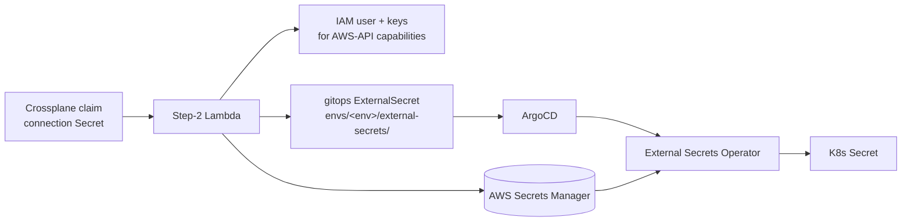

# External Secrets bootstrap

The app-facing secret-delivery layer for the Makeway platform. Credentials
Crossplane writes into each Claim's connection Secret are mirrored into AWS
Secrets Manager by the Step-2 worker, which also commits an
`ExternalSecret` per capability into the env overlay
(`argocd/apps/<app>/envs/<env>/external-secrets/`). External Secrets Operator
(ESO) materializes the matching `K8s Secret` into the app namespace as `{slug}`.
The Step-2 extract phase also commits an injection patch
(`inject/{slug}-env.yaml`, registered in the env kustomization `patches:`) that
wires that Secret into each `accessTo` service's Deployment as
`MAKEWAY_{SLUG}_{KEY}` env vars (`env[].valueFrom.secretKeyRef`).



## Cluster-side setup (once per environment cluster)

One cluster per environment (qa/uat/prod); run this on **each** cluster's own
ArgoCD:

1. **Install ESO + the store + that cluster's env-scoped ApplicationSet** — all
   bundled in the per-cluster bootstrap root:

   ```bash
   kubectl apply -k argocd/clusters/<env>   # <env> in qa/uat/prod — run on that cluster
   ```

   (`eso-install-application.yaml` is a managed Helm chart install, same pattern
   Crossplane uses; `store-application.yaml` is the kustomize root for this folder.)

2. **Seed the store credentials** (bootstrap-only, like `crossplane/secrets/`,
   gitignored). Copy `aws-credentials.example.yaml` to `aws-credentials.yaml`,
   fill in static IAM keys scoped to `secretsmanager:GetSecretValue` on
   `makeway/*`, and apply on each cluster — **not** tracked by git and **not**
   in the kustomization:

   ```bash
   kubectl apply -n external-secrets -f aws-credentials.yaml
   ```

The per-app ExternalSecrets need no extra setup: each env-scoped ApplicationSet
(`argocd/clusters/<env>/`) globs `argocd/apps/*/envs/<env>`, which includes the
`external-secrets/` folder the Step-2 extract phase commits to — each cluster
only materializes its own env's secrets.

## Migrating to managed EKS

Nothing app-facing changes. On EKS:

- Delete the static `aws-credentials` Secret and switch the
  `ClusterSecretStore` to IRSA (`spec.provider.aws.auth.jwt` with a
  `serviceAccountRef`), or use ESO's pod identity. This is exactly the same
  swap Crossplane's ProviderConfig makes.
- The app's `ExternalSecret` manifests and `envFrom` wiring stay byte-identical.

## Files

| File | Purpose |
|---|---|
| `cluster-secret-store.yaml` | The `makeway` ClusterSecretStore every ExternalSecret references. |
| `aws-credentials.example.yaml` | Documented example of the static-key Secret (real one is bootstrap-only, gitignored). |
| `eso-install-application.yaml` | ArgoCD Application installing ESO from its Helm chart. |
| `store-application.yaml` | ArgoCD Application syncing this folder's kustomize root. |