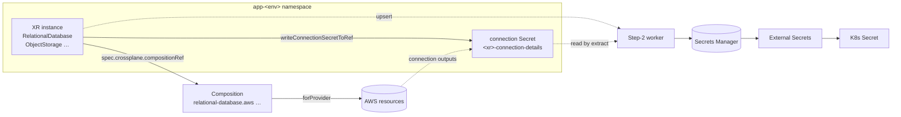

# Makeway Crossplane configuration

Crossplane turns the capability catalog into a Kubernetes API. A developer's
`rel_database` / `storage` / `messaging` capability becomes an **XR instance**
(namespaced composite resource — Crossplane v2 removed Claims) in the app's own
namespace; Crossplane expands it into the real AWS resources through a
**Composition**; the connection details land back in the same namespace for
the Step-2 Lambda to pick up.

This directory is the platform's contract surface. ArgoCD syncs it.



## Layout

```
crossplane/
├── providers/                    Provider + Function packages (CRDs + controllers)
│   ├── aws.yaml                  provider-family-aws + service packages, v2.7.1,
│   │                             + function-patch-and-transform (v2 pipeline mode)
│   └── provider-config.yaml      reference copy of the ProviderConfig (docs)
├── secrets/                      NOT ArgoCD-managed — bootstrap only
│   └── provider-creds.yaml       Namespace + Secret + ProviderConfig (static keys)
├── compositions/                 XRD (the schema) + Composition (the expansion)
│   ├── storage/                  ObjectStorage → S3 bucket          ✅ done
│   ├── database/                 RelationalDatabase → RDS + SG + subnet group  ✅ done
│   ├── queue/                    MessageQueue → SQS + DLQ           ✅ done
│   └── notification/             NotificationTopic → SNS            ✅ done
├── kustomization.yaml            the ArgoCD sync root
└── root-application.yaml         the ArgoCD Application that watches this dir
```

## Bootstrap (local cluster)

The cluster runs locally (k3d/kind) with ArgoCD already watching this repo, so
there is no EKS OIDC issuer and no IRSA. The AWS provider authenticates the same
way the platform's service accounts do (docs/design/AWS-Service-Accounts.md):
a dedicated IAM user, a scoped inline policy, static keys — never
`Principal: "*"`.

1. **Install Crossplane v2** (no Terraform involved — no EKS module exists yet).
   v2 is required: Compositions here use pipeline mode, and Claims no longer
   exist (the worker applies XR instances directly).

   ```sh
   helm repo add crossplane-stable https://charts.crossplane.io/stable
   helm upgrade --install crossplane --namespace crossplane-system \
     --create-namespace crossplane-stable/crossplane   # 2.x line
   kubectl get deployment crossplane -n crossplane-system   # version = 2.x
   ```

2. **AWS credentials.** Create the IAM user and a scoped policy:

   ```sh
   aws iam create-user --user-name makeway-crossplane
   # inline policy: RDS/S3/SQS/SNS build access + SecretsManager
   # (full ARN listing in docs/design/AWS-Service-Accounts.md)
   aws iam create-access-key --user-name makeway-crossplane
   ```

   Patch the real keys into the provider-creds Secret (gitignored at runtime,
   never committed):

   ```sh
   kubectl create secret generic provider-creds \
     --namespace crossplane-system \
     --from-literal=creds='{"accessKeyId":"AKIA...","secretAccessKey":"...","sessionToken":""}'
   ```

3. **Install the providers + the `function-patch-and-transform` Function +
   ProviderConfig:**

   ```sh
   kubectl apply -f crossplane/providers/aws.yaml    # includes the Function
   kubectl apply -f crossplane/secrets/provider-creds.yaml
   # verify: kubectl get provider -A ; kubectl get function ; kubectl get providerconfig
   ```

   The family + service packages take a couple of minutes to become
   `HEALTHY` (and the Function must too — every Composition is a single
   `function-patch-and-transform` pipeline step). Compositions won't reconcile
   XR instances until their provider (`provider-aws-s3` for storage) and the
   Function are installed.

4. **Register the sync:**

   ```sh
   kubectl apply -f crossplane/root-application.yaml -n argocd
   ```

   From here the four directories in `kustomization.yaml` are ArgoCD-managed.
   New Compositions are a commit + sync, not a kubectl call.

## Why each piece is where it is

| Piece | Reason |
|---|---|
| Providers ArgoCD-managed | The package versions are platform config. A bump in this repo is the single source of truth. |
| `secrets/` NOT ArgoCD-managed | It holds live credentials (static keys on a local cluster). syncOptions prune/selfHeal would happily "repair" a hand-applied real key back to the placeholder. |
| Compositions cluster-scoped | They are the platform contract, shared by every app namespace. The XR instances that use them are per app (v2 XRs are namespaced). |
| Provider pinned per Composition | Upbound split the old monolith into per-service packages; each Composition pins the one it uses so a family upgrade can't silently break an MR type. |
| XR namespace = app namespace | Crossplane writes the XR's connection Secret next to the pod that needs it. No cross-namespace secret chain. (v2 namespaced XRs replaced Claims; the function honors the XR's `writeConnectionSecretToRef` directly.) |

## Capability → Composition map

| CapabilityType | XRD | Managed Resources | Connection Secret |
|---|---|---|---|
| `rel_database` | `RelationalDatabase` | `DBSubnetGroup`, `SecurityGroup`, `SecurityGroupRule` (TCP 5432), `DBInstance` | endpoint, port, databaseName, username, password |
| `storage` | `ObjectStorage` | `Bucket` (+ future CloudFront) | bucketName, region, arn |
| `messaging` (queue) | `MessageQueue` | `Queue` + DLQ `Queue` | queueUrl, queueArn, dlqUrl, dlqArn |
| `messaging` (notification) | `NotificationTopic` | `Topic` | topicArn |

## Deliberate deviations from the first-pass plan

- **Compositions are Crossplane v2 pipeline mode.** Each Composition is a single
  `function-patch-and-transform` step (the Function is declared in
  `providers/aws.yaml`). The Function aggregates each MR's `connectionDetails`
  into the XR's connection Secret, honoring the XR's `spec.writeConnectionSecretToRef`
  and the `writeConnectionSecretToRef` input patches. No Claims, no
  `writeConnectionSecretsToNamespace`.
- **RDS master password is NOT created by the Composition.** The plan's sketch included
  an `aws_secretsmanager_secret` MR; wiring its *value* in requires a Kubernetes provider
  (the password lives in a K8s Secret, and Crossplane can't read arbitrary Secrets into a
  `forProvider`). Instead the Step-2 Lambda generates the password, writes it to a K8s
  Secret `{xrName}-creds` in the XR's namespace, and the Composition references it
  via `DBInstance.passwordSecretRef` (patched from the XR's own `metadata.name` /
  `metadata.namespace` — v2 XRs carry no claim labels). The Lambda later mirrors it to
  AWS Secrets Manager (`InfraRequirement.secretRef`). Same end state, no extra provider.
- **DB instance class comes from a capacity map.** `Capacity` (1–10) is the only size knob
  on `RelationalDatabase`; the Composition maps it to a concrete class via a `map` patch
  transform. That table (in `compositions/database/composition.yaml`) is the single place
  the platform team sizes databases — tune it there, no Lambda change.
- **Queue redrive uses a `dlqArn` XR parameter.** SQS `redrivePolicy` is a JSON string
  with no `Ref` field, so the DLQ ARN is passed by the Lambda (deterministic
  `arn:aws:sqs:{region}:{account}:{queueName}-dlq`) and combined with `maxReceiveCount`.
- **Platform-infra values are inline placeholders** (`__PLATFORM_VPC_ID__`,
  `__PLATFORM_PRIVATE_SUBNET_*__`, `__PLATFORM_VPC_CIDR__`, `__CLAIM_*__`) in the database
  Composition, same idiom as `provider-creds.yaml`. They get real values at bootstrap /
  per environment; on managed EKS the ingress source becomes the worker-node SG.

## Lifecycle notes

- XR instances are created by the Step-2 Lambda, deleted by the delete-app loop.
  `deletionPolicy: Delete` (the default) tears down AWS resources atomically
  per Composition.
- Drift is continuous: delete the S3 bucket from the console and Crossplane
  recreates it within a minute; edit a Composition in the repo and ArgoCD
  reapplies it within three.
- When the cluster moves to managed EKS, the IRSA story replaces the static
  `provider-creds` Secret: the ProviderConfig swaps `source: Secret` for
  `source: IRSA` and the key Secret goes away. The Compositions don't change.