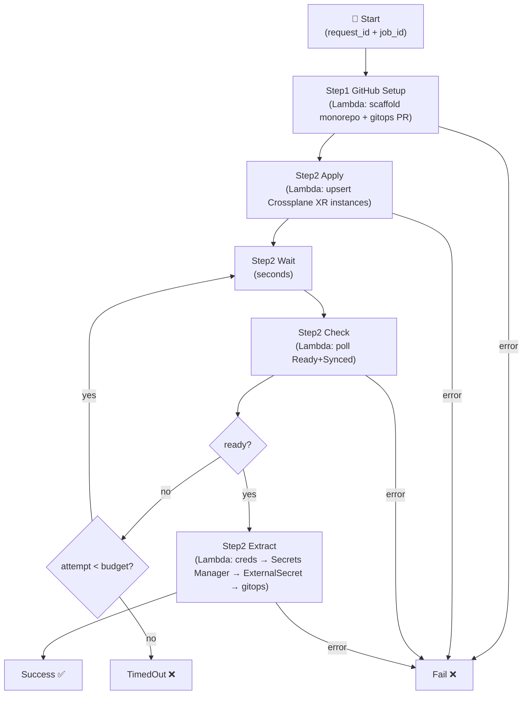
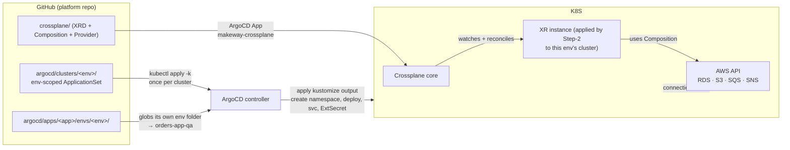
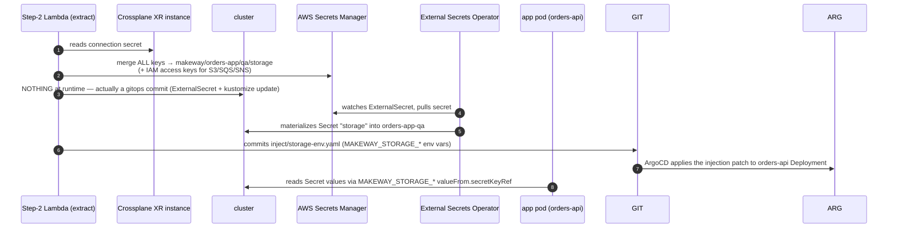
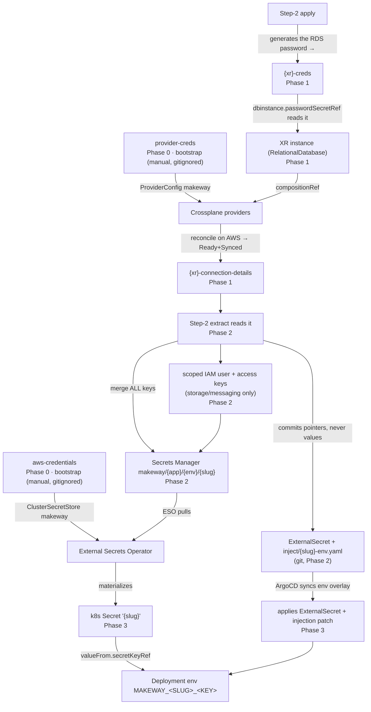
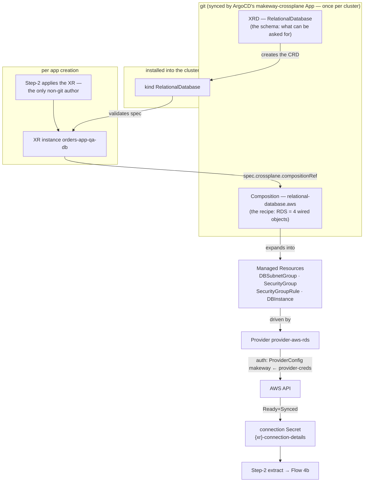
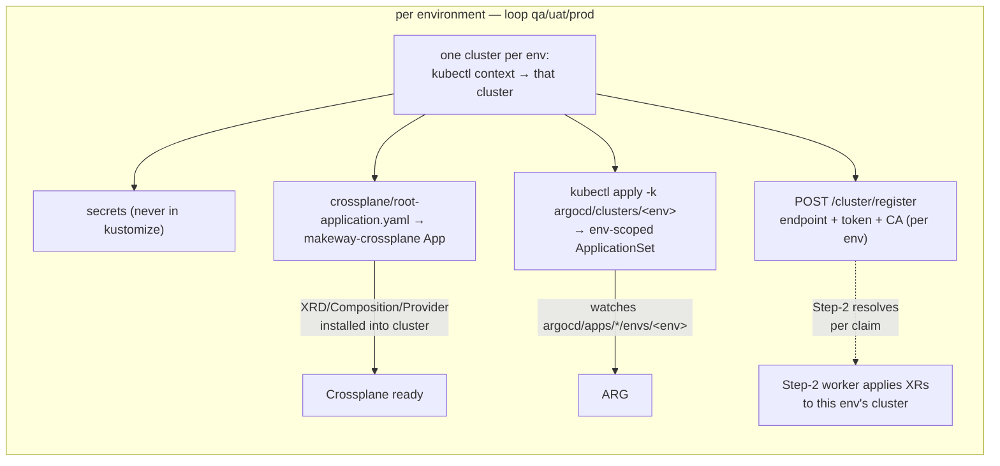
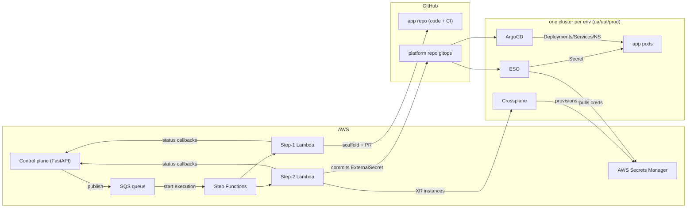

# Makeway App Flows — End-to-End Walkthrough

> [Documentation index](../README.md) › Design › App Flows

This document walks every flow in the Makeway platform **from zero**. Zero knowledge of
Crossplane, ArgoCD, External Secrets Operator (ESO), or GitOps assumed. Each flow is a
walkthrough with a concrete example (`orders-app`), a diagram, and every step spelled out.

> **The one-paragraph mental model**
> A developer asks Makeway to create an app. Two things must happen for that app to
> actually run:
> 1. **The code must exist** — a GitHub monorepo with the service code and CI.
> 2. **The infrastructure must exist** — a Postgres database, S3 bucket, SQS queue…
>    **and the app's containers must get deployed into a Kubernetes cluster.**
>
> Makeway splits the work between two orchestrators:
> - **AWS Step Functions** — the *planner/foreman* that says *"do this, then that,
>   wait until it's ready"*.
> - **ArgoCD + Crossplane (one pair per environment cluster — qa/uat/prod)** — the *workers
>   inside each cluster*. **Crossplane** creates cloud infra (RDS/S3/SQS/SNS) and hands
>   back connection credentials. **ArgoCD** watches a GitOps repo and applies whatever
>   the app's manifests say into *its own* cluster (the `Deployments`, and the
>   `ExternalSecret`s that pull the credentials into the app's namespace). Each env's
>   cluster only ever runs that env's apps (each ArgoCD's ApplicationSet globs only its own
>   `envs/<env>` folder) — and the Step-2 worker applies each capability's XR instances to
>   that same env's cluster, resolved from the control-plane Cluster registry.
>
> The whole thing is *asynchronous*: the control plane (FastAPI) accepts the request,
> writes rows, enqueues to SQS, and the workers drive everything to completion,
> reporting status back.

---

## The cast of characters

| Who | What it is | Where it lives | What it does |
|---|---|---|---|
| **Control plane** | FastAPI app | AWS ECS (or `uvicorn main:app --reload` locally) | REST API + Postgres (`app/`, `request`, `job`, `capability` rows) + publishes to SQS |
| **SQS queue** | `makeway-requests` | AWS | Decouples the API from the work |
| **SQS consumer Lambda** | tiny handler | AWS (`workers/sqs_consumer`) | Reads a message → starts a Step Functions execution |
| **Step Functions** | state machine `makeway-app-creation` | AWS | The foreman: runs Step-1, then Step-2 apply → wait → check → (loop) → extract |
| **Step-1 Lambda** | `step_1 - GitHub Setup/handler.py` | AWS | Creates the GitHub monorepo, scaffolds services + CI, writes `argocd/apps/<app>/` gitops, opens a PR |
| **Step-2 Lambda** | `step_2 - Infra Provisioning/handler.py` | AWS | Talks to **each env cluster over HTTPS** — per-capability `kubeApiEndpoint`/token/CA resolved from the control-plane Cluster registry (localtunnel in dev). Applies Crossplane XR instances, polls them Ready+Synced, extracts connection creds → Secrets Manager → gitops ExternalSecrets |
| **Clusters (one per env)** | Kubernetes | `qa`/`uat`/`prod`, each on your machine or EKS | Each cluster hosts its own Crossplane, ArgoCD, ESO — and eventually that env's pods. One `Cluster` row per env (endpoint + token + CA) |
| **Crossplane** | the infra-as-code engine INSIDE k8s | `crossplane-system` ns on each cluster | Turns "I want a database" (YAML) into actual RDS/S3/SQS/SNS via AWS API |
| **ArgoCD** | the GitOps engine INSIDE k8s | `argocd` ns on each cluster | Watches its **env-scoped** ApplicationSet (`argocd/clusters/<env>/` → `argocd/apps/*/envs/<env>`); applies them to its own cluster; self-heals |
| **ESO (External Secrets Operator)** | Secret-sync engine INSIDE k8s | `external-secrets` ns | Watches `ExternalSecret` CRs; pulls AWS Secrets Manager values; materializes `Secret`s the app pods can read |
| **Platform repo** | `kapil4457/Makeway-IDP` (GitHub) | GitHub | The GitOps source of truth: `crossplane/` configs + `argocd/apps/<app>/` per-app overlays + `argocd/clusters/<env>/` per-cluster bootstrap |

There are **two control-plane endpoints** the whole async machinery hinges on
(`controllers/internal_router.py`):

| Endpoint | Who calls it | What it does |
|---|---|---|
| `GET /internal/requests/{request_id}` | Step-1 & Step-2, at the start of each action | Returns the app's desired state: app name, services, environments, **capabilities with `config` + `environment` + `namespace`**, and the job status |
| `POST /internal/requests/{request_id}/status` | Step-1 & Step-2, at the end of each action | Applies job status (`in_progress/success/failed`), rolls `Request` status up, stores repo URLs / gitops path / per-Activity capability outputs |

Both are guarded by the `X-Internal-API-Key` header (fail-closed). The control plane is
**the source of truth** — the workers *read* desired state from it and *write back* outcomes
(then store the real infra references there).

---

## The three gates (why names matter — the whole system hangs on this)

Every worker needs to find things deterministically. There are **no hand-offs of addresses**
— everyone **recomputes the same name from the same inputs**. This is the mutation-free
"identity" rule that makes retries safe:

```
app name  +  environment  +  capability slug  →  everything else
```

| Thing | Name pattern | Example |
|---|---|---|
| Namespace | `{app}-{env}` | `orders-app-qa` |
| Crossplane XR instance | `{app}-{env}-{slug}` | `orders-app-qa-storage` |
| RDS password Secret | `{xrName}-creds` | `orders-app-qa-db-creds` |
| Connection Secret (written by Crossplane) | `{xrName}-connection-details` | `orders-app-qa-storage-connection-details` |
| AWS Secrets Manager secret | `{prefix}/{app}/{env}/{slug}` | `makeway/orders-app/qa/storage` |
| ExternalSecret (in gitops) | `external-secrets/{slug}-external-secret.yaml` | `external-secrets/storage-external-secret.yaml` |
| Env-injection patch (in gitops) | `inject/{slug}-env.yaml` (registers in env `patches:`) | `inject/storage-env.yaml` |
| Injected pod env var | `MAKEWAY_{SLUG}_{KEY}` (from the ESO Secret) | `MAKEWAY_STORAGE_BUCKET_NAME` |
| IAM user (storage/messaging only) | `makeway-{app}-{env}-{slug}` | `makeway-orders-app-qa-storage` |

---

## Flow 1 — Full app creation (the golden path)

This is the complete life of a request end to end. Read it straight through — each story
section that follows it zooms into the parts you may not understand yet (Crossplane,
ArgoCD, ESO, secrets).

### The story

> **At a friendly hackathon,** a platform engineer named Alex on the Makeway team fills a
> form: "I want an app called **orders-app**. In **qa** and **prod**, I need a
> **Node.js `orders-api` service**, a **Postgres database**, an **S3 bucket**, an **SQS
> queue** — and the service should be allowed to talk to all three."
>
> Makeway turns that one request into every resource the app will ever need — without a
> human touching AWS or the cluster again.

### Step 0 — The request lands (control plane)

1. Alex calls `POST /app/create` with the payload (below), an auth token, and an
   `Idempotency-Key` header.
2. The **API validates** (team membership, env constraints, capability config) and writes
   **one atomic transaction** (`app_creation_service.py`):
   - an `App` row,
   - for **each of `qa` and `prod`**, a `Service` row per service and a `Capability` +
     `InfraRequirement` row per capability, plus `CapabilityAccess` join rows,
   - a `Request` (status `PENDING`) and a `Job` (step `create_project`, status `PENDING`).
3. Only after the commit succeeds does it **publish to SQS**: `{request_id, job_id}`.
   If anything above fails, nothing reaches the queue — the request is simply not accepted.

Request payload for the example (field names are snake_case — that's the request
wire format the DTOs validate; camelCase is the model/DTO-attribute convention):

```json
{
  "app_name": "orders-app",
  "team_name": "orders-team",
  "env_config": [
    {
      "env": "qa",
      "services": [{"service_type": "node-js", "service_name": "orders-api"}],
      "capabilities": [
        {"config": {"type": "rel_database", "name": "orders-db", "capacity": 5}, "access_to": ["orders-api"]},
        {"config": {"type": "storage", "s3": {"region": "us-east-1"}}, "access_to": ["orders-api"]},
        {"config": {"type": "messaging", "queue": [{"name": "order-events"}]}, "access_to": ["orders-api"]}
      ]
    },
    { "env": "prod", "services": [ ... same ... ], "capabilities": [ ... same ... ] }
  ]
}
```

### Step 1 — SQS → Step Functions (the foreman picks up)

4. The **SQS consumer Lambda** reads the message and calls
   `stepfunctions.start_execution(stateMachineArn, name="app-creation-{request_id}-{job_id}", input=body)`.
   The **deterministic execution name** is the idempotency contract: at-least-once SQS can't
   start two overlapping executions for the same request.

The state machine (`terraform/modules/app_creation_step_functions/main.tf`):



### Step 2 — Step-1 Lambda builds the code + gitops

5. **Step-1** calls `GET /internal/requests/{request_id}` and sees the desired state.
6. It **creates the GitHub repo** `kapil4457/orders-app` (via the GitHub API, PAT-backed).
7. It **scaffolds each service** from golden-path templates into the monorepo, and writes a
   per-service CI workflow `.github/workflows/ci-orders-api.yaml`.
8. It **renders the gitops tree** `argocd/apps/orders-app/` (base + apps + `qa`, `prod`
   envs overlays) and opens a **PR** to the platform repo: `makeway: ArgoCD setup for orders-app`,
   squash-merged automatically (`merge_method: "squash"`, `delete_branch_after_merge`).
9. It calls `POST /internal/requests/{request_id}/status` with `status: "success"`,
   `appRepoUrl`, `gitOpsPath`, and per-service `repoPath` — then the state machine moves on.

> **Idempotency here:** if the job already says `success`, Step-1 exits early
> (`{"status": "skipped"}`). Repo creation checks existence first; tree pushes diff against
> the current tree and skip committed when nothing changed. Re-running is always safe.

### Step 3 — Step-2 Lambda: `apply` (create the infrastructure desiderata)

10. **Step-2 `apply`** fetches the same desired state. For **each capability**, it renders
    one or more Crossplane **XR instance** manifests from templates
    (`claim_templates/*.yaml`) substituting the deterministic names.
11. For the **database** capability it *first* writes a `Secret` `{xrName}-creds` into the
    namespace (a freshly generated password via `secrets.token_urlsafe(24)`) — the Composition will reference it.
12. It **upserts** each XR into the cluster via the kube API
    (`/apis/makeway.io/v1beta1/namespaces/orders-app-qa/relationaldatabases`, etc.):
    `GET` → 404 means `POST`; existing means `PATCH` (merge). *This is it* — from now on
    **Crossplane owns the infrastructure**, controlled only by these YAML objects.
13. It reports `in_progress` and the state machine enters the **Wait → Check → Choice**
    loop.

### Step 4 — The loop: Crossplane makes it real, Step-2 verifies

14. **Crossplane** (inside the cluster) sees the new XR instance, loads the **Composition**
    for its type, and calls **AWS** to create the actual RDS/S3/SQS/SNS (details in
    [Flow 2](#flow-2--crossplane-infra-as-code-inside-the-cluster)).
15. Every `Wait` (e.g. 30s) seconds, **Step-2 `check`** re-fetches each XR instance and
    reads its `status.conditions`. Only when **both `Ready=True` and `Synced=True`** on every
    capability does it return `ready: true`.
16. If not ready but `attempt < max`, the state machine `Pass` state does
    **`States.MathAdd($.attempt, 1)`** and loops back. If the budget runs out, the
    execution fails with `Step2Timeout`.

### Step 5 — Step-2 Lambda: `extract` (harvest the credentials and wire the app's secrets)

17. Once everything is `Ready+Synced`, **Step-2 `extract`** reads each XR's **connection
    Secret** `{xrName}-connection-details` (Crossplane wrote it into the namespace when it
    finished — see [Flow 2](#flow-2--crossplane-infra-as-code-inside-the-cluster)).
    Keys include `endpoint`, `port`, `username`, `password` (RDS); `bucketName`, `region`,
    `arn` (S3); `queueUrl`, `queueArn`, `dlqUrl`, `dlqArn` (SQS); `topicArn`, `topicName` (SNS).
18. For **storage/messaging** capabilities (S3/SQS/SNS — the ones pods call the **AWS API**
    directly), it provisions a **scoped IAM user** `makeway-orders-app-qa-storage` with an
    inline least-privilege policy (exactly `s3:ListBucket/Get/Put/DeleteObject` on this one
    bucket, etc.) and creates **access keys** (recreating them is not possible — the secret
    key is only shown once, so it reuses existing keys on retries).
19. It **merges** all connection keys + any IAM keys into **AWS Secrets Manager** at
    `{secrets_prefix}/orders-app/qa/storage` (`makeway/orders-app/qa/storage`), preserving
    the existing `aws_secret_access_key` on re-runs.
20. It commits an **ExternalSecret** into the gitops env overlay and registers it in the
    env `kustomization.yaml` (DIFF first, only changed blobs, push to `main` directly).
21. It reports each capability result to the control plane —
    `{capabilityId, status, outputRef: {provisioned, claims:[{slug, connection, secretsManagerArn}]}, secretRef}` —
    so the DB now knows where everything lives.

### Step 6 — ArgoCD + ESO deliver into the cluster

22. Each environment cluster runs its **own env-scoped ApplicationSet**
    (`argocd/clusters/qa/`, `argocd/clusters/uat/`, `argocd/clusters/prod/`). The **qa**
    cluster's set detects `argocd/apps/orders-app/envs/qa`, the **prod** cluster's set
    detects `.../envs/prod` — each generates the matching `orders-app-<env>` Application
    **on its own cluster only**, so qa never schedules prod's pods (and vice versa).
23. ArgoCD syncs each Application: creates the `orders-app-qa` Namespace, applies
    NetworkPolicies (default-deny + allow-same-namespace), the `Deployment` + `Service` for
    `orders-api` (image `makeway-placeholder/orders-api:pending-first-build` until
    the app's own CI runs), **and** the new `ExternalSecret`.
24. **ESO** sees the ExternalSecret, calls AWS Secrets Manager (using the bootstrap IAM keys
    in `external-secrets/aws-credentials`) and materializes a **K8s `Secret`**
    `storage` (etc.) in `orders-app-qa`.
25. **Step-2 also commits an injection patch** per capability: for every service in the
    capability's `accessTo`, it renders a strategic-merge patch
    `inject/<slug>-env.yaml` targeting that service's Deployment and registering it in the
    env kustomization `patches:`. The patch wires the capability's ESO-materialized Secret
    into the Deployment as **`MAKEWAY_<SLUG>_<KEY>`** env vars — e.g. `orders-api` gets
    `MAKEWAY_STORAGE_BUCKET_NAME`, `MAKEWAY_STORAGE_REGION`, `MAKEWAY_STORAGE_AWS_ACCESS_KEY_ID`
    (each via `valueFrom.secretKeyRef`). ArgoCD rolls the overlay, so the running pod now has
    the connection info. Credentials never land in git — only the *pointer* (ExternalSecret)
    and the *source of truth* (Secrets Manager) plus the reference-by-name patch exist.

### Step 7 — The app's own CI (later)

26. When an `orders-app` dev merges a PR to `feature/*`, the scaffolded CI
    (`ci-orders-api.yaml`) builds the image `kapil4457/makeway-orders-app:orders-api-<sha>`
    and **bumps the image line in `argocd/apps/orders-app/envs/qa/orders-api-patch.yaml`** in
    the platform repo.
27. ArgoCD sees the git change → syncs (with `selfHeal` + `prune`) → rolling-update rolls
    out the new image to **qa only**. `main → prod` promotes prod only. Each tier stays
    isolated (NetworkPolicies + per-env overlays).

---

## Flow 1b — Updating an existing app (delta reconciliation)

> Weeks later Alex says: "orders-app is growing — bump the database from the 10GB tier to
> the 50GB tier, and give it the SQS queue we skipped at creation."

### `POST /app/{app_name}/update`

The body is a **bare JSON list** of per-environment deltas — `[{env, services?,
capabilities?, remove_services?, remove_capabilities?}]` — validated against the exact
same schemas as create (`EnvConfig` → `ServiceConfig` / discriminated capability
configs), so an update can ask for anything a creation could have — *and* it can also
tear things down. It carries the same `Idempotency-Key` contract and the same
owner-only authorization, plus an optional `?confirm=true` query flag.

Example (grow the database tier 1 → 5, i.e. 10GB → 50GB, and add a queue) — note the
request-body field names are snake_case, matching the create DTO (`env_config` /
`access_to`; camelCase is the model/DTO-attribute convention, not the wire):

```json
[
  {
    "env": "qa",
    "capabilities": [
      {"config": {"type": "rel_database", "name": "db", "capacity": 5}, "access_to": ["orders-api"]},
      {"config": {"type": "messaging", "queue": [{"name": "order-events"}]}, "access_to": ["orders-api"]}
    ]
  }
]
```

**Delta semantics.** Each entry states the desired state for what it mentions;
anything not mentioned stays untouched. A capability is matched on
`(capabilityType, env)` — found → its `InfraRequirement.config` is overwritten and
`Capability.status` resets to `PENDING`; missing → it is created exactly as create
would. New `services` rows are created the same way (`{name}-{env}`, deduplicated).
`access_to` must be non-empty (an update never creates an invisible capability). The
update is rejected while another request for the app is still reconciling — retry
after it completes.

**Removal semantics** (teardown inside the delta). Each entry may also carry
`remove_services: [names]` and `remove_capabilities: [capability types]` — a
capability is matched on `(capabilityType, env)`, a service on its `{name}-{env}`
row — and both lists may appear in the same request:

```json
[
  {
    "env": "qa",
    "remove_capabilities": ["messaging"],
    "remove_services": ["orders-worker"]
  }
]
```

The guard rails, all validated before anything is written:

- **No overlap** — an item named in both the add and remove lists is a 400.
- **`access_to` may not reference a service being removed** — wire the capability's
  new accessor set in the same request.
- **No orphaning** — removing a service that is a capability's *last accessor* in
  that env is rejected, naming the capability: add another accessor or ask for the
  capability's removal too.
- **Prod needs explicit intent** — a `prod` entry with a non-empty removal list (and
  any `prod` delete, see Flow 1c) requires `?confirm=true`.

The pipeline runs in **mixed mode**: kept capabilities are upserted as always while
removed ones are torn down in the same run —

- **Step-2 `apply`** deletes the removed claims (the XR instance, its `{xr}-creds`
  Secret, plus best-effort per-claim Secrets Manager + IAM cleanup) and upserts the
  kept ones; **`check`** stays pending until the removed XRs read back **404**;
  **`extract`** skips removed capabilities entirely.
- **Step-1** regenerates the env overlays *without* the removed capability slugs —
  their `inject/{slug}-env.yaml` and `external-secrets/{slug}-external-secret.yaml`
  files (and their kustomization lines) are deleted in the same PR, and surviving
  capabilities' extract lines are still preserved. A **fully-removed service**
  (removed from *every* env it exists in) also loses its shared
  `argocd/apps/<app>/apps/<base>/` folder, its env patch files, and its CI workflow
  (`.github/workflows/ci-<base>.yaml`) — the services-monorepo folder is user code
  and stays. Removing a service from only *some* envs keeps the shared bits.
  If the update removes **every** service, the whole `argocd/apps/<app>/` tree goes
  (mirroring a last-env delete).
- **The control plane purges the removed rows only on SUCCESS** (`_purge_removed_items`
  in the status callback): Capability, InfraRequirement, CapabilityAccess,
  DeploymentSetup and Service rows for the removed items — in FK-safe order, in the
  callback's single commit. Until then a failed run reconciles instead of losing its
  teardown targets.

**Why the pipeline needs no new states.** The update service writes the merged
desired state, then creates a `Request` (`UPDATE_APP`) + `Job` and enqueues the same
`{request_id, job_id}` message. Everything downstream is the creation pipeline
re-running idempotently against the *merged* state:

- **Step-1 re-runs** and no-ops where nothing changed; a new service just adds its
  scaffold folder (tree-diff push). The regenerated env `kustomization.yaml` is merged
  with what extract previously committed (`_preserve_gitops_extras`), so the PR never
  drops capability `inject/` patches or `external-secrets/` resources.
- **Step-2 apply re-upserts every kept claim.** Unchanged capabilities produce identical
  XR specs (no-op merge-patch); changed parameters (capacity, queues…) update the XR
  desired state; new capabilities create new XR instances. Check/Extract then run as
  always — extract re-derives every capability's credentials and re-commits the
  ExternalSecrets/inject patches idempotently.
- Crossplane does the actual reconciliation: e.g. the database `capacity` tier maps to
  an instance class **and** `allocatedStorage` = **10 GB per tier point** (tier 1 =
  10GB, tier 5 = 50GB) — resizing the tier resizes storage.

Concurrent updates are rejected while the app's latest request is still
`PENDING`/`IN_PROGRESS` (shared Capability rows would race) — retry once it completes.

---

## Flow 1c — Deleting an environment (`DELETE /app/{app_name}/envs/{env}`)

> Months later the team sunsets the qa copy of orders-app. Alex wants *everything* for
> `(orders-app, qa)` gone — the deployments, the database, the bucket, the queues, the
> secrets wiring — but the app itself (its repo, its prod copy) must keep running.

### The request

`DELETE /app/{app_name}/envs/{env}?confirm=…` with the usual auth token and
`Idempotency-Key`. Guards, in order: idempotent replay (same key → the original
request/job ids, message "App delete request already exists"); owner-only; **no other
request for the app may be in flight**; the environment's cluster must be registered;
the app must actually **have services in that env**; and `prod` requires
`?confirm=true` (mirrored by the update endpoint for prod removals).

**Nothing is deleted at submit.** The service writes a `Request` (`DELETE_APP`,
`rawRequest: {app_name, env}`) + a `Job` and enqueues — the desired-state rows stay
exactly where they are so every retry can re-derive the deterministic XR names it has
to tear down.

### The pipeline (a teardown run of the same state machine)

The workers fetch the same `GET /internal/requests/{id}` — which now carries
`requestType: "delete_app"` and the `rawRequest` — and branch:

- **Step-1 (GitHub/gitops):** instead of scaffolding, it removes the environment's
  whole gitops overlay — `argocd/apps/<app>/envs/<env>/` — via a tree-delete commit and
  opens the removal PR (`makeway: remove ArgoCD setup for orders-app (qa)`). If this was the
  **app's last environment**, the prefix widens to `argocd/apps/<app>/` — the entire
  tree goes, but the **App record and the services repo stay** (documented decision:
  strip the app fully, keep the record; a full teardown incl. the repo is a manual,
  out-of-band act).
- **Step-2 (Crossplane):** `apply` **deletes** every XR instance in that env
  (`DELETE …/relationaldatabases/{xr}`, 404-tolerant), each claim's `{xr}-creds`
  Secret, and sweeps best-effort (never fatal): Secrets Manager under
  `makeway/<app>/<env>/` and the scoped IAM users `makeway-<app>-<env>-*`.
  `check` stays pending until every XR reads back **404**; `extract` reports success
  immediately (nothing left to harvest).
- **ArgoCD does the namespace teardown.** Deleting `envs/<env>/` removes the
  ApplicationSet's Application for `(app, env)` → ArgoCD's `prune` deletes everything
  the overlay created — the Namespace itself, the Deployments/Services, the
  ExternalSecrets, and the connection Secrets. Crossplane then cascades the XR
  deletions into real AWS teardown (RDS instance, bucket, queues). The worker never
  touches namespaces directly — git removal *is* the deletion mechanism.

### The purge (only on SUCCESS)

When the pipeline's status callback reports `SUCCESS`, `_purge_env` (in
`internal_api_service.py`) hard-deletes the environment's desired-state rows in
FK-safe order — DeploymentSetup → CapabilityAccess → InfraRequirement → Service →
Capability — inside the callback's single commit. Other environments' rows are
untouched; the `Request`/`Job` rows remain as audit. Until that callback, a failed
run can simply be retried: the rows still say what to tear down.

---

## Flow 2 — Crossplane: infra-as-code *inside* the cluster

**One-off conceptual map first** (this is where the "I know nothing about Crossplane" gap
closes):

| Concept | Analogy | In Makeway |
|---|---|---|
| **XRD (CompositeResourceDefinition)** | The *interface/schema*: "here's what a 'RelationalDatabase' can be asked for" | `makeway.io/v1beta1` + kinds `RelationalDatabase`, `ObjectStorage`, `MessageQueue`, `NotificationTopic` |
| **XR instance** | A *request ticket*: "make me a database named orders-app-qa-db with capacity 5" | namespaced, name = `{app}-{env}-{slug}` |
| **Composition** | The *recipe/template*: "RDS = subnet group + security group + ingress rule + DB instance, wired like this" | pipeline-mode, one `function-patch-and-transform` step |
| **Managed Resource (MR)** | The concrete AWS resource object | `DBInstance`, `Bucket`, `Queue`, `Topic`, … (`.m.upbound.io` API groups) |
| **Provider** | The AWS *driver* that talks to the AWS API | `provider-family-aws` + per-service providers (rds/ec2/s3/sqs/sns/iam/secretsmanager), each with a name like `provider-aws-rds` |
| **ProviderConfig** | The *credentials* the providers use | a `ProviderConfig` named `makeway` pointing at Secret `crossplane-system/provider-creds` (bootstrap-only) |
| **Connection Secret** | The *output parcel* Crossplane writes when finished | `{xrName}-connection-details` in the XR's namespace |

**The moment the XR is `apply`-ed, Crossplane takes over.** It does three things:

1. **Schedules** the XR to its Composition (`compositionRef`) and sees the claimed fields.
2. Runs the **pipeline** (function-patch-and-transform) → produces the desired **MR list**
   (RDS ⇒ subnetgroup + securitygroup + ingress rule + dbinstance) with fields patched from
   the XR's parameters.
3. **Reconciles** each MR against AWS until **`Ready=True, Synced=True`**, then
   **publishes the connection Secret**.

### Database example (the most intricate)

The XR instance step-2 applies (rendered from the template):

```yaml
apiVersion: makeway.io/v1beta1
kind: RelationalDatabase
metadata:
  name: orders-app-qa-db
  namespace: orders-app-qa
  labels: { app: orders-app, environment: qa, managed-by: makeway, capability-id: "..." }
spec:
  crossplane:
    compositionRef: { name: relational-database.aws }
  writeConnectionSecretToRef:
    name: orders-app-qa-db-connection-details
  parameters:
    databaseName: orders
    masterUsername: makeway_admin
    capacity: 5
    region: ap-south-1
    publiclyAccessible: true        # local-cluster seam (RDS_PUBLICLY_ACCESSIBLE=true)
    ingressSourceCidr: 0.0.0.0/0
```

The password is **not** in the XR — it's in the `orders-app-qa-db-creds` Secret step-2
wrote *before* applying the XR. The Composition's `dbinstance` resource references it:

| recipe step | MR kind | interesting patches |
|---|---|---|
| **subnetgroup** | `rds.aws.m.upbound.io/v1beta1 DBSubnetGroup` | region ← `spec.parameters.region` |
| **securitygroup** | `ec2.aws.m.upbound.io/v1beta1 SecurityGroup` | vpcId ← `spec.parameters.platformVpcId` (SSM at provision time); region ← param |
| **ingress** | `ec2.aws.m.upbound.io/v1beta1 SecurityGroupRule` | cidrBlocks[0] ← `spec.parameters.ingressSourceCidr`; refs securitygroup |
| **dbinstance** | `rds.aws.m.upbound.io/v1beta1 DBInstance` | engine=postgres, engineVersion=17, **instanceClass ← capacity map** (1,2→t4g.micro … 10→t4g.xlarge), **allocatedStorage ← capacity × 10 GB** (tier 1 = 10GB, tier 5 = 50GB), **passwordSecretRef.name ← `metadata.name` + `string.fmt: "%s-creds"`**, namespace ← `metadata.namespace`, `skipFinalSnapshot=true`, `backupRetentionPeriod=1`, `storageEncrypted=true` |

The `dbinstance`'s `connectionDetails` block declares the parcel: `endpoint`, `port`,
`databaseName`, `username` (from `status.atProvider`) + `password` (from the Secret key) —
so when RDS is Ready, Crossplane writes `orders-app-qa-db-connection-details` with exactly
those keys. **That is the Secret step-2 reads in `extract`.**

> **Where placement comes from:** the infrastructure is created in a *pre-existing*
> platform VPC/subnets. The database XRD requires `platformVpcId` +
> `platformSubnetIds`; the Step-2 Lambda reads them from the SSM parameter
> `/makeway/platform/vpc` (published by the platform root's terraform) at provision
> time and renders them into each claim — nothing environment-specific is committed
> to the crossplane tree. See [Flow 5](#flow-5--cluster-bootstrap).

### Ingredient examples (the simpler ones)

| capability | XR kind | Composition | MRs | Connection Secret keys |
|---|---|---|---|---|
| storage | `ObjectStorage` | `object-storage.aws` | `s3.aws.m.upbound.io Bucket` (public-access-blocked) | `bucketName`, `region`, `arn` |
| messaging | `MessageQueue` | `message-queue.aws` | DLQ `Queue` (`{queueName}-dlq`), `Queue` (redrive policy JSON via `CombineFromComposite` + `string.fmt`) | `queueUrl`, `queueArn`, `dlqUrl`, `dlqArn` |
| notification | `NotificationTopic` | `notification-topic.aws` | `sns.aws.m.upbound.io Topic` | `topicArn`, `topicName` |

The SQS redrive is built purely by patching: the worker computes `dlqArn` and passes it as a
parameter, and the Composition does `CombineFromComposite` with
`string.fmt: '{"deadLetterTargetArn":"%s","maxReceiveCount":%d}'`.

---

## Flow 3 — ArgoCD: GitOps *inside* the cluster

**ArgoCD is just a controller whose desired state is a git repo instead of a DB row.** It
polls the repo (or gets webhooks), builds the **kustomize** output from the YAML, and
applies it to the cluster. Two features that matter here:

- **selfHeal** — if someone `kubectl delete`s a `Deployment`, ArgoCD puts it back.
- **prune** — if a file disappears from git, ArgoCD deletes the object it created.

### What runs ArgoCD's *app catalog*? One env-scoped ApplicationSet per cluster

There is **no single global ApplicationSet** anymore. Each environment cluster owns one at
`argocd/clusters/<env>/env-application-set.yaml` (globs only its own env folder), and each
applies it onto *itself* via `kubectl apply -k argocd/clusters/<env>`:

```yaml
apiVersion: argoproj.io/v1alpha1
kind: ApplicationSet          # NOT an Application — it GENERATES Applications
spec:
  goTemplate: true            # Go templating — the legacy {{path[2]}} fasttemplate
                              # forms fail Go's parser and generate 0 applications
  generators:
    - git:
        repoURL: https://github.com/kapil4457/Makeway-IDP
        revision: main
        directories:
          - path: argocd/apps/*/envs/qa        # 🧲 scans the repo — qa dirs ONLY
  template:
    metadata:
      name: '{{ index .path.segments 2 }}-qa'   # e.g. orders-app-qa (the qa copy)
    spec:
      source: { path: '{{ .path.path }}', repoURL: ..., targetRevision: main }
      destination: { namespace: '{{ index .path.segments 2 }}-qa', server: https://kubernetes.default.svc }
      syncPolicy: { automated: { prune: true, selfHeal: true }, syncOptions: [CreateNamespace=true] }
```

When Step-2's extract push adds `argocd/apps/orders-app/envs/qa`, the **qa cluster's**
ApplicationSet **immediately notices the new directory** and **creates Application
`orders-app-qa`** whose source path is that overlay and whose destination namespace is
`orders-app-qa`. The prod cluster's set — a different ApplicationSet resource in a different
cluster — would never see it, because it only globs `argocd/apps/*/envs/prod`. No
Application files were authored by hand — they are *generated*. (`server:
https://kubernetes.default.svc` targets the cluster the set itself runs on — no `argocd
cluster add` needed.)

> The two-level "ApplicationSet → generated Applications → each overlay" pattern is called
> the **app-of-apps / GitOps wheel**. It replaces a magical recursive `Application` over
> `argocd/apps` which would also try to apply the shared `apps/<service>` roots
> standalone — the ApplicationSet lets each env overlay be its own independent App with its
> own namespace, prune domain, and selfHeal.

### What each overlay contains

```
argocd/apps/orders-app/
├── base/
│   └── network-policies.yaml        # default-deny-ingress + allow-same-namespace-ingress
├── apps/
│   └── orders-api/
│       ├── deployment.yaml          # replicas 1, image __IMAGE__, port 8000
│       ├── service.yaml             # ClusterIP → targetPort containerPort
│       └── kustomization.yaml
└── envs/
    ├── qa/
    │   ├── namespace.yaml           # Namespace orders-app-qa (one env owns its ns)
    │   ├── kustomization.yaml       # resources: namespace.yaml, ../../base, ../../apps/orders-api
    │   │                            # patches: [orders-api-patch.yaml, ...]
    │   ├── orders-api-patch.yaml    # image: <env-specific image tag>
    │   └── external-secrets/
    │       └── storage-external-secret.yaml   # ← added by Step-2 extract
    └── prod/
        └── ...same shape...
```

The `envs/<env>/kustomization.yaml` deliberately has **no `namespace:` field** — ArgoCD
places everything into the Application's destination namespace (`orders-app-qa`), which
would collide if kustomize renamed the Namespace too.

### ArgoCD + Crossplane together (how both live in one cluster)

The **Crossplane configs** are themselves a gitops App:
`crossplane/root-application.yaml` (name `makeway-crossplane`, source path `crossplane`,
automated sync). So each cluster's ArgoCD manages two kinds of things:

| Type | Managed by | Example objects |
|---|---|---|
| **Crossplane** (infra-as-code engine) | `makeway-crossplane` App | XRDs, Compositions, Providers, Function |
| **App runtime + ESO** (the app's pods + secret deliver) | one generated App per `(app, env)` on **that env's** cluster | Deployment, Service, Namespace, NetworkPolicies, ExternalSecret |

**But Crossplane never manages per-app XR instances — those are step-2's job, applied
imperatively over the kube API** (the `apply` action). ArgoCD/Crossplane deliberately
*do not* manage app CRs, keeping app-creation fully automatic/manual-free. The XRD/Composition
are managed by ArgoCD; the XR instances are step-2's tickets. And because step-2 resolves each
claim's cluster endpoint/token from the control-plane Cluster registry, the XR instances land
on the **environment's own cluster** — the same one whose ArgoCD then rolls out the app.



---

## Flow 4 — Secrets end-to-end (never in git)

**The rule:** *pointers* (ExternalSecrets) and *desired state* (crossplane configs) live in
git. The *actual credentials* (RDS password, IAM access keys, provider keys) live only in
**AWS Secrets Manager** and the cluster.



**What is bootstrap-only** (the one manual cluster step; everything else is automatic) —
these are deliberately **excluded from kustomize** so ArgoCD `selfHeal` can't clobber them:

| Secret | Namespace | Used by |
|---|---|---|
| `crossplane-secrets/provider-creds` (via `ProviderConfig makeway`) | `crossplane-system` | Crossplane providers → AWS |
| `external-secrets/aws-credentials` (via `ClusterSecretStore makeway`) | `external-secrets` | ESO → AWS Secrets Manager |

---

## Flow 4b — Secret lifecycle: who creates what, when, and who reads it

There are **seven kinds of secret** in the system, born at **four different moments**, with
three different authors. This table is the whole supply chain at a glance:

| Secret | Created by | When | Lives in | Read by |
|---|---|---|---|---|
| `provider-creds` | bootstrap, by hand | once per cluster | k8s Secret, `crossplane-system` | Crossplane providers (via `ProviderConfig makeway`) → AWS API |
| `aws-credentials` | bootstrap, by hand | once per cluster | k8s Secret, `external-secrets` | ESO (via `ClusterSecretStore makeway`) → AWS Secrets Manager |
| `{xr}-creds` (e.g. `orders-app-qa-db-creds`) | Step-2 `apply` | **before** applying the XR | k8s Secret, app namespace | Composition `dbinstance.passwordSecretRef` |
| `{xr}-connection-details` | Crossplane | when the XR turns `Ready+Synced` | k8s Secret, app namespace | Step-2 `extract` |
| scoped IAM user + access keys | Step-2 `extract` | storage/messaging only | AWS IAM | the app's pods (their S3/SQS/SNS API calls) |
| Secrets Manager `makeway/{app}/{env}/{slug}` | Step-2 `extract` | merge of connection + IAM keys | AWS Secrets Manager | ESO |
| k8s `Secret` `{slug}` (e.g. `storage`) | ESO | when ArgoCD syncs the ExternalSecret | k8s Secret, app namespace | the app's pods, as `MAKEWAY_<SLUG>_<KEY>` env vars |

**The whole lifecycle as a graph** (each edge says *who does it*, the `Phase n` labels say
*when*):



**The six moments, in words:**

1. **Bootstrap** — you create the two static-key Secrets once per cluster. Nothing
   app-related yet: this only *roots* the two operators (Crossplane, ESO) so they *can* talk
   to AWS later. Both stay gitignored and out of every kustomize root (`selfHeal` would
   clobber them).
2. **Before the XR exists** — Step-2 generates the RDS master password and drops it into
   `{xr}-creds` *before* applying the XR, because the Composition's `dbinstance` references
   that key (`passwordSecretRef`). This is the **only secret the worker pushes *in***; every
   other secret in the system is written *out*.
3. **When the XR is ready** — Crossplane writes `{xr}-connection-details` into the app
   namespace. That is the *output parcel*: endpoint, port, dbname, user, password (RDS);
   bucketName, region, arn (S3); queue/dlq urls + arns (SQS); topic ARN + name (SNS).
4. **Extract harvests** — for storage/messaging (the pods call the **AWS API** directly) it
   also creates a scoped IAM user (`makeway-{app}-{env}-{slug}`, least-privilege inline
   policy) and merges *everything* — connection keys + IAM keys — into Secrets Manager at
   `makeway/{app}/{env}/{slug}`. *No* per-capability secret reaches AWS API-capable pods any
   other way.
5. **Only pointers go to git** — Step-2 commits an `ExternalSecret` (a *pointer* naming the
   SM secret) and an `inject/{slug}-env.yaml` patch (wiring `MAKEWAY_<SLUG>_<KEY>` into every
   `accessTo` service's Deployment). No secret value ever touches git.
6. **Delivery** — ArgoCD syncs the overlay → ESO sees the ExternalSecret, pulls from Secrets
   Manager via the ClusterSecretStore (the `aws-credentials` from moment 1), materializes k8s
   Secret `{slug}` → ArgoCD also applies the injection patch → the running pod reads
   `MAKEWAY_<SLUG>_<KEY>` via `valueFrom.secretKeyRef`. The pod never holds the SM ARN — it
   only sees env vars.

---

## Crossplane zoom-in — the dependency map

Two layers with **different authors and different lifecycles**. Mixing them up is the #1
source of "what is what" confusion:

| Thing | Author | Managed by | Lifetime |
|---|---|---|---|
| XRD (schema) + Composition (recipe) + Provider/Function packages + ProviderConfig | platform team (this repo) | ArgoCD (`makeway-crossplane` App) — git is the single source | lives as long as the cluster; drift-guarded |
| XR instance (the ticket) | **Step-2 only** | *nobody* — an imperative apply over the kube API; Crossplane reconciles it | per app creation; deleted by the delete-app loop |
| Managed Resources (`DBInstance`, `Bucket`, `Queue`, …) | Crossplane, expanding the Composition | Crossplane | tied to the XR's `deletionPolicy` (default `Delete`) |



**The four rules that make it composable:**

1. **XRDs are schemas, Compositions are recipes, XR instances are tickets.** The XRD says
   "a RelationalDatabase may be asked for *databaseName, capacity, region*". The Composition
   says "when you see such a ticket, stand up these 4 AWS objects wired like *this*". The XR
   is the filled-in ticket.
2. **Only Step-2 authors XR instances.** No line in `crossplane/` or `argocd/apps/` ever
   contains one — an app creation is a one-shot event, not a drift-guarded template. Hence
   ArgoCD's `selfHeal`/`prune` never fights Step-2's retries, and Crossplane upsert-merges
   repeated applies.
3. **Everything below the XR is git.** XRDs + Compositions + Provider versions + the
   ProviderConfig are the *platform contract*; a bump in this repo is the single source of
   truth and ArgoCD reapplies it in minutes. That is precisely why `crossplane/` is
   ArgoCD-managed and `crossplane/secrets/` is not.
4. **The XR is the seam.** Above it: control-plane desired state (Step-2). Below it: real
   AWS (Crossplane). And the XR's connection Secret is the exact parcel the secret lifecycle
   (Flow 4b) then carries onward.

---

## Flow 5 — Cluster bootstrap (one-time, manual — repeated per cluster)

> This is where the setup you just did lives — the cluster-side, "make the platform
> possible" steps. Everything after this is automatic. **There is one cluster per
> environment** (qa / uat / prod), so steps 1–8 run **once per cluster** — on that cluster's
> own `kubectl` context.

1. **kind/k3d cluster** for `qa` (repeat with a fresh cluster for `uat`, `prod`); `kubectl`
   context points at that cluster.
2. **Install ArgoCD** (Helm or manifests into `argocd` ns).
3. **Install Crossplane** (core into `crossplane-system` ns).
4. **Install the External Secrets Operator** (Helm `external-secrets` into `external-secrets`
   ns) — via the gitops App `eso-install-application.yaml` (bundled per cluster below).
5. **Apply the bootstrap secrets** (the two static-key Secrets above) — a one-time manual
   `kubectl apply`, **not** in any kustomization/ArgoCD root (selfHeal would clobber).
6. **VPC placement facts** — nothing to fill by hand: the `makeway-crossplane`
   Application syncs `crossplane/` directly (no overlay), and the Step-2 Lambda
   reads the platform VPC id / private subnets from the SSM parameter
   `/makeway/platform/vpc` at provision time (published by the platform root's
   terraform; also printed by `terraform -chdir=terraform output platform_*`).
7. **Create `makeway-worker` SA + RBAC** and the long-lived token Secret. Start the localtunnel
   tunnel exposing the cluster's kube-apiserver (`localTunnel/README.md`), and **register the
   cluster** in the control plane — this replaces the old GHA-var approach:

   ```bash
   curl -X POST "$CONTROL_PLANE_URL/cluster/register" \
     -H "Authorization: Bearer $USER_TOKEN" \
     -H "Content-Type: application/json" -d '{
       "clusterName": "qa-cluster",
       "environment": "qa",
       "kubeApiEndpoint": "https://<subdomain>.loca.lt",
       "kubeToken": "<makeway-worker SA token>",
       "kubeCaCert": ""
     }'
   ```

   `kubeCaCert` empty = the TLS-disabled dev tunnel (verify stays off). Re-run the same
   call to **refresh** the endpoint/token after a tunnel/subdomain change; a different environment
   than the row's is rejected (`409 CLUSTER_ENVIRONMENT_MISMATCH`). Verify redacted:
   `GET /internal/clusters/qa-cluster` returns the endpoint and `hasToken: true`, never the
   token itself. The Step-2 worker resolves each claim's cluster from this registry; the
   Lambda's `MAKEWAY_KUBE_*` env vars remain only a *fallback* for rows without a token.
8. **Apply the per-cluster gitops bundle** — this installs Crossplane's managed App, ESO,
   and this cluster's env-scoped ApplicationSet in one shot:

   ```bash
   kubectl delete applicationset makeway-apps -n argocd   # one-time: remove the old global set
   kubectl apply -k argocd/clusters/<env>                # <env> in qa/uat/prod — run on that cluster
   ```

   From then on, every new `argocd/apps/<app>/envs/<env>` directory seen by *this* cluster's
   set auto-generates its Application (`orders-app-qa` on the qa cluster only, etc.).



---

## Summary — connecting it all



**The three loops, in one breath:**

- **AWS loop (Step Functions + Lambdas):** creates code+gitops (Step-1) and crosses the
  infra request to the cluster, *waits* for Crossplane, then harvests and commits the
  secret pointers.
- **Cluster loop (Crossplane):** watches XR instances ↓ → recipes (Compositions) → real
  AWS infra → connection secrets.
- **Cluster loop (ArgoCD + ESO):** watches the gitops repo → applies app manifests (ArgoCD)
  and materializes secrets (ESO) into the app's namespace.

Retries are safe at every layer because every name is deterministic, every upsert is an
idempotent diff, and the control plane is the one source of truth.

## Notes & caveats

- The **health reporter** (`workers/health_reporter`) closes a further loop: it lists
  ArgoCD Apps per `(app, env)` (`GET /internal/deployment-groups/{app}/{env}`) and records
  each service's rollout state via `POST /internal/deployment-setup` so the UI shows real
  service health rather than `unknown`.
- **Teardown flows** exist in both shapes — per-item removals inside the update delta
  ([Flow 1b](#flow-1b--updating-an-existing-app-delta-reconciliation)) and the
  env-scoped delete
  ([Flow 1c](#flow-1c--deleting-an-environment-delete-appapp_nameenvsenv)). In
  both, rows purge only on the SUCCESS callback, namespace teardown is ArgoCD's
  (overlay removal cascades), and Secrets Manager/IAM cleanup is best-effort.
- Envs are canonically **qa/uat/prod** (no `dev`).
- The `localtunnel` tunnel is the dev-only seam for the *cluster*; `rds_publicly_accessible`
  and `rds_ingress_cidr` are the same seam for *RDS* (pods live off-VPC locally).