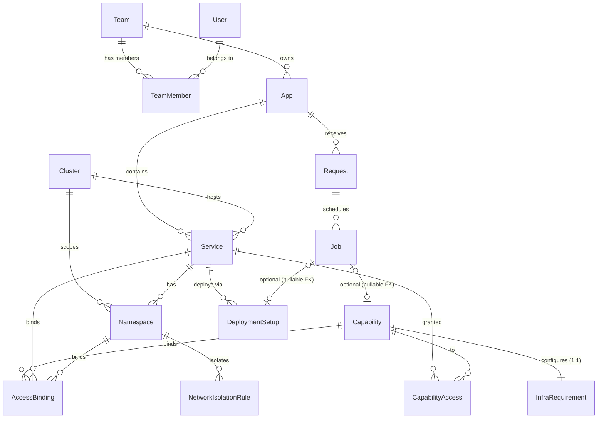

# Makeway — Database Schema

**Database:** PostgreSQL.

> **Audit columns:** most tables extend `SharedAudit`, which provides
> `createdBy` / `createdAt` / `modifiedBy` / `modifiedAt`. Where a table has
> them they are shown as `createdAt / createdBy` and `modifiedAt / modifiedBy`
> without repeating the full definition. Only `TeamMember` does not inherit
> audit columns.
>
> **Stored enum values:** `str`-based Python enums. SQLAlchemy persists the
> enum **member name** (`FAST_API`) unless `values_callable` is configured —
> the readable values below (`fast-api`) are the API-facing wire values.

---

## Team

Organizational team that owns apps.

```
teamId (PK)
teamName (unique)
createdAt / createdBy
modifiedAt / modifiedBy
```

**Why:** Ownership root for Apps and permissions.

---

## User

Individual developer using Makeway.

```
userId (PK, UUID)
email (unique)
passwordHash
createdAt / createdBy
modifiedAt / modifiedBy
```

**Why:** Referenced by `createdBy`/`modifiedBy` across all tables; auth and RBAC.

---

## TeamMember

Join table: Team ↔ User.

```
teamMemberId (PK)
role [member, …]                 -- default "member"; no audit columns
isDeleted (boolean, default false)
teamId (FK → Team)
userId (FK → User)
UNIQUE (teamId, userId)
```

**Why:** Users can belong to multiple teams. `isDeleted` preserves audit
history when a user leaves a team instead of losing the record.

---

## App

Top-level unit Makeway manages. One App = one GitHub monorepo.

```
appId (PK)
appName (unique)
teamId (FK → Team)
appRepoUrl (nullable)
gitOpsPath (nullable) — folder inside the platform repo, e.g. argocd/apps/<appName>/
  (platform repo URL is constant config — core.config.GITOPS_REPO_URL — not stored)
createdAt / createdBy
modifiedAt / modifiedBy
```

**Why:** Anchor entity. All Services, Requests, and Jobs trace back to it.

---

## Cluster

Reference data for the fixed EKS clusters.

```
clusterId (PK)
clusterName (unique)
kubeApiEndpoint
environment                 -- "qa" | "uat" | "prod"
createdAt / createdBy
modifiedAt / modifiedBy
```

**Why:** There is no separate `Environment` table. An environment is a
per-request concept (`AppConfig.env_config`) that resolves to the Cluster
registered for that environment via `Cluster.environment`. Services and
Namespaces carry the `clusterId` that identifies the physical EKS cluster.

---

## Service

One deployable unit inside an App's monorepo, scoped to a cluster.

```
svcId (PK)
svcName                      -- "<service_name>-<env>", e.g. "orders-api-qa"
serviceType [spring-boot, fast-api, node-js]
repoPath (nullable)
appId (FK → App)
clusterId (FK → Cluster)
createdAt / createdBy
modifiedAt / modifiedBy
UNIQUE (appId, svcName, clusterId)
```

**Why:** Monorepo apps contain multiple services. `svcName` embeds the
environment because the same logical service deploys to every environment and
the environment is not a separate table. Capabilities bind to services via
`CapabilityAccess`; Namespaces, AccessBindings, and DeploymentSetup all scope
to a specific service.

---

## Namespace

Kubernetes namespace for a Service on a Cluster.

```
namespaceId (PK)
k8sNamespaceName
status [pending, in_progress, success, failed]
serviceId (FK → Service.svcId)
clusterId (FK → Cluster)
createdAt / createdBy
modifiedAt / modifiedBy
UNIQUE (serviceId, clusterId)
```

**Why:** Tracks the actual K8s namespace backing each service+cluster pair and
its reconciliation status.

---

## Capability

Requested infrastructure (database, storage, messaging, …), per environment.

```
capabilityId (PK)
capabilityType               -- discriminator string, e.g. "rel_database", "storage",
                               "messaging"
status [pending, in_progress, success, failed, partially_failed]
errorMessage (nullable)
createdAt / createdBy
modifiedAt / modifiedBy
```

**Why:** Core unit of "what infra does this app need, and is it ready." A
Capability is not directly bound to services — which services may use it is
recorded in `CapabilityAccess`. The `capabilityType` mirrors the `type`
discriminator on the capability config DTOs (`CapabilityConfig` union), and
the full configuration lives in the related `InfraRequirement.config`.

---

## CapabilityAccess

Join table linking a Capability to the Services allowed to use it.

```
capabilityAccessId (PK)
capabilityId (FK → Capability)
serviceId (FK → Service.svcId)
createdAt / createdBy
modifiedAt / modifiedBy
```

**Why:** A capability is shared across one or more services in an environment;
this row is the explicit grant. Written during app creation (one row per
entry in a capability's `access_to` list, resolved through
`ServiceRepository.get_by_name("<svc>-<env>")`).

---

## InfraRequirement

Configuration and provisioning output for a Capability.

```
infraRequirementId (PK)
capabilityId (FK → Capability)
config (jsonb)               -- storageGb, ttl, tier, replicas, etc.
secretRef (text, nullable)   -- Secrets Manager ARN/path only, never the value
outputRef (jsonb, nullable)  -- endpoint, URL, ARN, bucket name, etc.
errorMessage (nullable)
createdAt / createdBy
modifiedAt / modifiedBy
```

**Why:** Separates input config from provisioning output. `jsonb` avoids schema
changes per capability type. `secretRef`/`outputRef` split enforces
credentials never land in plain columns.

---

## AccessBinding

IAM grant linking a Service to a Capability within a Namespace.

```
accessBindingId (PK)
roleArn
accessType [read, write, read_write]
capabilityId (FK → Capability)
serviceId (FK → Service.svcId)
namespaceId (FK → Namespace)
createdAt / createdBy
modifiedAt / modifiedBy
UNIQUE (capabilityId, serviceId, namespaceId)
```

**Why:** Explicit, auditable access grant per (capability, service, namespace).
A service has no access to a capability unless a row exists here — this is
what enforces "shared vs. bound" resource access at the IAM layer.

---

## NetworkIsolationRule

Tracks applied network-level isolation for a Namespace.

```
ruleId (PK)
namespaceId (FK → Namespace)
ruleType [k8s_network_policy, security_group]
targetRef (text)              -- policy name or security group ID
status
createdAt / createdBy
modifiedAt / modifiedBy
```

**Why:** Visibility into whether NetworkPolicy/Security Group isolation was
actually applied for a namespace, since namespaces alone don't isolate network
traffic.

---

## DeploymentSetup

ArgoCD registration and sync status for a Service.

```
deploymentSetupId (PK)
serviceId (FK → Service.svcId)
status
argocdAppName (nullable)
lastSyncedAt (nullable)
errorMessage (nullable)
createdAt / createdBy
modifiedAt / modifiedBy
```

**Why:** Deployment mechanism, not an infra resource, thus kept separate from
Capability. Links to `Job` via `Job.deploymentSetupId` for async reconciliation.

---

## Request

A single user-initiated action.

```
requestId (PK)
idempotencyKey (unique)
requestType [create_app, add_capability, delete_capability, delete_app, update_resource, update_app]
appId (FK → App, nullable)
requestStatus [pending, in_progress, success, failed, partially_failed]
rawRequest (jsonb)
createdAt / createdBy
modifiedAt / modifiedBy
```

**Why:** `idempotencyKey` prevents duplicate submission from creating duplicate
infra. `rawRequest` preserves the exact desired state submitted.

---

## Job

A single async execution attempt from the queue.

```
jobId (PK)
requestId (FK → Request)
capabilityId (FK → Capability, nullable)
deploymentSetupId (FK → DeploymentSetup, nullable)
step [create_project, provision_infra, argocd_setup]
status [pending, in_progress, success, failed]
stepFunctionExecutionArn (text, nullable)
errorDetail (text, nullable)
createdAt / createdBy        -- serves as the job's submission time
modifiedAt / modifiedBy      -- reflects latest attempt state change
```

**Why:** Tracks retry history, per-attempt errors, and queue traceability —
required for idempotent retries and debugging stuck/failed steps.

---

## App Creation Write Pattern

A single `POST /app/create` submission performs one atomic unit of work
(committed once by the service; each repository only flushes):

```
App ── 1
├── Service × (services × environments)          appId + clusterId
├── Capability × (capabilities × environments)   capabilityType = config.type
│   ├── InfraRequirement × 1                     config = config.model_dump()
│   └── CapabilityAccess × (access_to services)  serviceId via svcName "<svc>-<env>"
Request × 1                                       idempotencyKey, rawRequest
Job × 1                                           requestId, step=create_project
```

If any step fails, the whole registration rolls back — no half-created app.

---

## Entity Relationships



At a glance: **Team** is the ownership root, **App** is the anchor of a
monorepo, **Service** is one deployable in that monorepo on one **Cluster**
(where the environment lives), **Capability** is the desired infrastructure
with its **InfraRequirement** config/output, **Request** captures one
user action, and **Job** is a single async attempt at executing it.