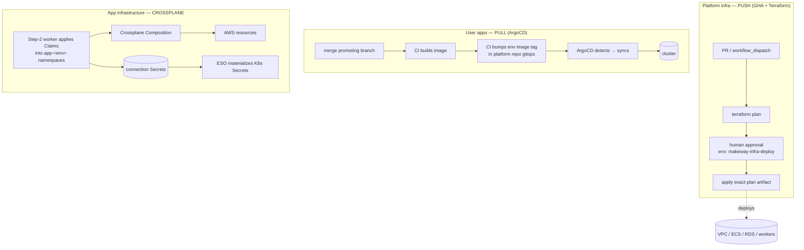

# Deployment Model

Why the platform's own infrastructure is deployed one way, and the apps it generates are deployed another. The two look similar from the outside; the constraints aren't, so the design intentionally goes in two directions.

## Two different problems

There are two deployment concerns in this repo:

1. **Our platform** — VPC, EKS, RDS, IAM, SQS, the step functions, the control plane itself.
2. **User apps** — services Makeway generates and manages for teams, deployed onto EKS.

Problem 1 is changed by a handful of people a few times a month, and can take the whole platform down if it goes wrong. Problem 2 is changed by every team using the platform, constantly, and is exactly the thing we promised to make boring for them.



## Platform infrastructure: push

GitHub Actions runs Terraform. Changes are manual (`workflow_dispatch`), a plan job runs and uploads the plan, then an apply job behind the `makeway-infra-deploy` environment runs `terraform apply ../plan/tfplan` with the exact artifact.

**Why push:**

- **A Terraform plan has to be seen before it's executed.** The whole point of Terraform is the diff. GitOps-style pull would put the plan after the merge and leave no human checkpoint between "what's about to change" and "what changed." We're not accepting that for the VPC or RDS.
- **Terraform already reconciles.** Desired state in `.tf`, actual state in the S3 state file, diff, apply. A second reconciler (ArgoCD) on top of a reconciler would fight it over drift, and the platform own's enough drift problem (see below).
- **The cluster can't bootstrap its own operator.** ArgoCD runs on EKS. If a mis-sync breaks the cluster, it breaks the thing that would recover it. The push pipeline stays reachable exactly when the cluster is not.
- **Review/apply must use the same plan.** Apply executes the artifact that was reviewed, not a fresh plan. Fresh plans drift; artifacts don't.
- **Operations are serialized by hand** — `concurrency: terraform-deploy` across all four workflows. Two Terraform runs never race for the state lock.
- **Frequency doesn't justify running a reconciler.** We touch this once a week at most. ArgoCD is always-on machinery for always-on change.

The OIDC role bootstrap deserves mentioning here: Actions gets no static keys, just a role trustable from `main`. That's the only pull-ish thing in this tier, and it's about credentials, not delivery.

## User apps: pull

Generated apps run the loop:

```
merge to a promoting branch (feature/* → qa, release/* → uat, main → prod)
  → CI builds + pushes that env's image
  → CI bumps that env's image tag in the platform repo
  → ArgoCD detects → syncs to EKS
```

**Why pull:**

- **No team's CI should ever hold cluster access.** The gitops repo is the write path. A workflow in a service repo can commit a YAML change; it cannot `kubectl` anything, even by accident. That boundary is the whole security model for hundreds of apps.
- **One screen shows everything.** ArgoCD lists every app, every environment, with sync state. For a platform where apps are created by other teams, that's the operational surface the platform team actually runs on.
- **A new app is just a directory.** The ApplicationSet's git generator discovers `argocd/apps/*/envs/*`. Step 1 of the state machine lands the configs as a PR and ArgoCD picks the app up with zero wiring. No kubectl apply, no register-the-app step, nothing to forget.
- **Drift is reverted, not reported.** `selfHeal: true`. The incident hotfix someone makes with `kubectl edit` disappears within minutes and git stays the truth. For a platform whose pitch is "declared state is real," this is the mechanism that keeps the pitch honest.
- **Rollback is a revert.** Bad tag, `git revert` on the bump commit, push, ArgoCD rolls it. The platform team does not get paged into every team's bad deploy.
- **Onboarding gate flicked on by GitHub settings.** Step 1 auto-merges its PR today only because branch protection isn't enabled. The moment required reviews turn on, new apps get eyes before they land — a repo setting, not a code change.

## Gitops configs in the platform repo, not per-app repos

The usual suggestion is a gitops repo per app. This project does the opposite — everything under `argocd/apps/<app>/` in the platform repo itself.

- **One repo, one ApplicationSet, one PAT.** Nothing to create or wire per app.
- **The control plane already writes there.** Step 1 opens a single PR containing every manifest a new app needs. Per-app repos would add per-app repo creation, per-app secrets wiring, per-app cleanup when the app dies.
- **Sprawl doesn't scale up.** 20 apps × 1 repo each is a real maintenance load; 20 directories is not.

What this gives up: you can't granularly grant a team write access to just their app's configs — they can write the platform repo or they can't. Acceptable while this is one org and internal; it's the first thing to revisit if Makeway ever serves real external tenants.

## CI writes the image tag; no image updater

The version bump is a commit written by the build that produced the image — a `sed` over the env patch files in the cloned platform repo.

- **Every deploy provably maps to a build.** Git history says "bump orders-api image to `<sha>`"; the deploy and the commit that caused it are one thing.
- **No extra watcher.** ArgoCD Image Updater would poll the registry and commit on its own schedule — another component, another failure mode, and its commits don't carry the context of the build. The bump being a side effect of a passing build is simpler to reason about.
- **It's a sed.** Cheap, precise, and the diff shows exactly one line per service per env.

The tradeoff is write contention: every service's CI commits into one repo. When the platform repo gets busy enough, that's the moment to split — listed below.

## Summary

| What | Model | Why, in one line |
|---|---|---|
| Platform infra (VPC, EKS, RDS, control plane) | push, GHA + Terraform | plans need human review; Terraform already reconciles; the cluster can't bootstrap its own operator |
| User apps (generated services) | pull, ArgoCD | no cluster creds in CI; drift self-heals; rollback is git; a new app is a new folder |
| GitOps source of truth | single platform repo | one ApplicationSet, one PAT, and the control plane already writes there |
| Image tag updates | CI commits to git | every deploy maps to a build SHA; no registry watcher to fail |

## Future enhancements

Roughly in the order this repo will actually need them.

1. **Branch protection on the platform repo.** The free win. Required reviews block Step 1's auto-merge — which is designed for that — and each new app gets human eyes during onboarding. No code change.
2. **Per-app gitops repos, but only when contention bites.** When many CI runs are racing to push tag bumps into one main, split configs per app and add the repo URLs to the ApplicationSet generators. The model handles multiple repos already. Not before.
3. **Argo Rollouts.** Canary-shaped delivery for user apps. Fits the current model cleanly (a Rollout CRD next to the Deployment). Worth having the day a team asks for safer deploys rather than after one bites them.
4. **Atlantis for platform infra.** PR comments with `terraform plan`, apply on merge. Still push, still the same gate, just better review ergonomics than the workflow console. Only worth it once more than a couple of people touch Terraform regularly.
5. **A real prod cluster.** Today all environments share one EKS cluster. When prod separates, the ApplicationSet gains a per-env destination server and nothing else in the model changes.
6. **Image Updater as a planned off-ramp.** If the CI-commit approach proves noisy, swapping annotations on and removing the sed step is a narrow change. Kept as an exit, not a plan.