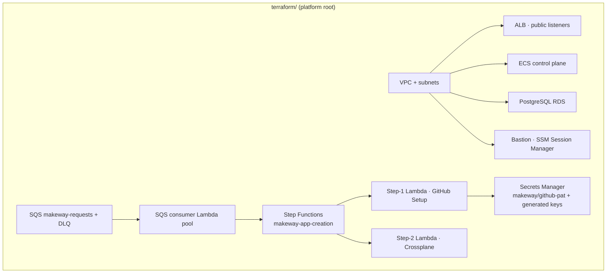

# Terraform

Makeway keeps **one centralized Terraform repository** for the platform's own
infrastructure. There are three distinct layers, each with its own state:

```
terraform/
├── bootstrap/                        # GitHub Actions OIDC identity
│   ├── main.tf / variables.tf / outputs.tf
│   └── (own state:  bootstrap/terraform.tfstate)
│
├── main.tf                           # The platform root
│                                      (own state:  platform/terraform.tfstate)
│
├── modules/                          # Reusable AWS modules
│   ├── vpc/  eks/  ecs/  alb/  rds/  sqs/  s3/  sns/  cloudfront/  oidc/
│   ├── sqs_consumer/                 # Lambda pool → Step Functions
│   ├── app_creation_step_functions/  # worker Lambdas + the state machine
│   └── remote_backend/
│
├── terraform.tfvars.example          # var skeleton (real values are gitignored)
└── .terraform.lock.hcl
```

## The state model

| Root | State key | Owns |
|---|---|---|
| `terraform/bootstrap/` | `bootstrap/terraform.tfstate` | GitHub OIDC provider + `github-actions-terraform` role |
| `terraform/` | `platform/terraform.tfstate` | VPC, SQS, ALB, ECS control plane, RDS, bastion, worker Lambdas + state machine |

Both live in the shared S3 bucket `makeway-terraform-state` (versioning + SSE-S3
enabled, public access blocked, native S3 locking with `use_lockfile = true`).

The separation is deliberate: a `terraform destroy` of the platform root
**never touches the OIDC state**, so CI always stays able to redeploy after a
teardown. Destroy the OIDC identity only from inside `terraform/bootstrap/`,
and only after the platform is down.

## What the platform root creates



Notably absent: **no EKS cluster**. User apps land on a local cluster today
(ArgoCD + Crossplane live there). `modules/eks` and the dormant
`clusters/{qa,uat,prod}/` roots are the managed-EKS path for later — note those
roots still point at a `platform/network/terraform.tfstate` key that predates
the current `platform/terraform.tfstate`, so they are unwired leftovers until
the EKS migration lands. The cluster is a **Terraform var** (the Step-2 Lambda
gets its endpoint/token from `terraform.tfvars`), not a dimension of generated
apps — Crossplane provisions their *infrastructure* (AWS resources), ArgoCD
provisions their *deployment* (K8s manifests), so there is no per-app Terraform
root at all.

## Reusable modules

Shared capability/infra modules live under `modules/` and are the only route to
new platform resources:

| Module | Purpose |
|---|---|
| `vpc` | VPC + private/public subnets + AZ layout |
| `sqs` | App-creation queue (makeway-requests) + DLQ |
| `sqs_consumer` | Lambda pool that watches the queue and starts executions of the state machine (deterministic names for idempotent fan-out) |
| `app_creation_step_functions` | The two worker Lambdas (handlers zipped with their template folders) + the Step Functions `makeway-app-creation` state machine. Keeps the Step-2 secrets (kube endpoint/token/CA, IAM keys) in Lambda env vars |
| `ecs` | EC2-launch-type cluster hosting the control plane (task role scoped to the app-creation queue) |
| `alb` | Control-plane front door; task SGs admit traffic only from the ALB SG |
| `rds` | Platform PostgreSQL (DB subnet group + SG scoped to the ECS task SG) |
| `eks` / `oidc` / `s3` / `sns` / `cloudfront` / `remote_backend` | The managed-EKS and auxiliary modules kept ready for later |

### How the Step-2 Lambda is parameterized

The `app_creation_step_functions` module bakes the bits the Crossplane worker
needs into its Lambda environment:

| Variable | Meaning |
|---|---|
| `kube_api_endpoint` / `kube_ca_cert` / `kube_token` | How the Lambda reaches the (pinggy-tunneled) local cluster's kube-apiserver; `kube_ca_cert` stays empty for the raw-TCP pinggy tunnel |
| `secrets_prefix` | Secrets Manager prefix (`makeway`) — secrets are named `{prefix}/{app}/{env}/{slug}` |
| `rds_publicly_accessible` / `rds_ingress_cidr` | The local-cluster seam (pods run off-VPC); flip off / to VPC CIDR on managed EKS |
| `step2_wait_seconds` / `step2_max_attempts` | Wait/Check loop budget for claim readiness |

## Platform CI/CD (push model)

Changes to the platform are applied by GitHub Actions with **OIDC** — no static
keys in GitHub:

- `deploy-infra` — `workflow_dispatch`. The `plan` job compiles a `tfplan`
  artifact plus the zip packages for the consumer + Step-1 Lambdas (they're
  built at plan time and `dist/` is gitignored); the `apply` job runs behind
  the **`makeway-infra-deploy`** environment (a manual approval gate) with
  `concurrency: terraform-deploy` so two runs never race for the state lock.
  Apply executes the exact reviewed plan artifact.
- The OIDC role assumption uses GitHub's immutable subject claim
  (`environment:makeway-infra-deploy` for apply, `ref:refs/heads/main` for
  plan) — the trust policy allows both.

The control-plane URL is a Go repo Actions variable (`MAKEWAY_CONTROL_PLANE_URL`)
surfaced as `TF_VAR_control_plane_url`, so the Step-1 Lambda knows where to
report.

## Application infrastructure is NOT here

Older versions of this repo generated a per-app Terraform root
(`terraform/app-infra/<app>/<env>/`) and ran `terraform apply` for each
capability from Fargate. That is gone. Application infrastructure is now
declared as **Crossplane Claims** by the Step-2 worker and reconciled by
Crossplane's compositions on the cluster — the platform Terraform has nothing
to do with it, and there is no per-app Terraform state.

See [crossplane/README.md](../crossplane/README.md) for the composition model,
and [docs/design/Deployment-Model.md](../docs/design/Deployment-Model.md) for
why the platform is push and the apps are pull.

## First-time bootstrap

From an empty AWS account: create the state bucket, provision the OIDC
identity from `terraform/bootstrap/`, then apply the platform root. The full
walkthrough (including the short-lived SSO credential dance and the GitHub
secrets/variables to set) is in [BOOTSTRAP.md](BOOTSTRAP.md).

```sh
# 1. state bucket (Terraform can't create its own backend)
aws s3api create-bucket --bucket makeway-terraform-state --region ap-south-1 \
  --create-bucket-configuration LocationConstraint=ap-south-1
aws s3api put-bucket-versioning --bucket makeway-terraform-state \
  --versioning-configuration Status=Enabled

# 2. OIDC identity (own root + own state)
cd terraform/bootstrap && terraform init && terraform apply

# 3. platform root
cd terraform && terraform init && terraform plan && terraform apply
```

Record `github_actions_role_arn` from the bootstrap output and set it as the
`AWS_ROLE_ARN` Actions secret — every subsequent change goes through CI.